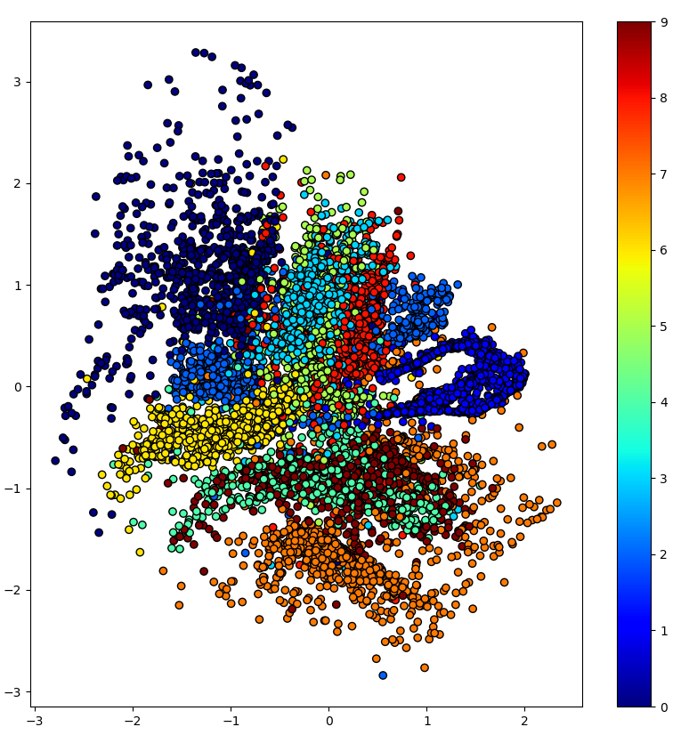
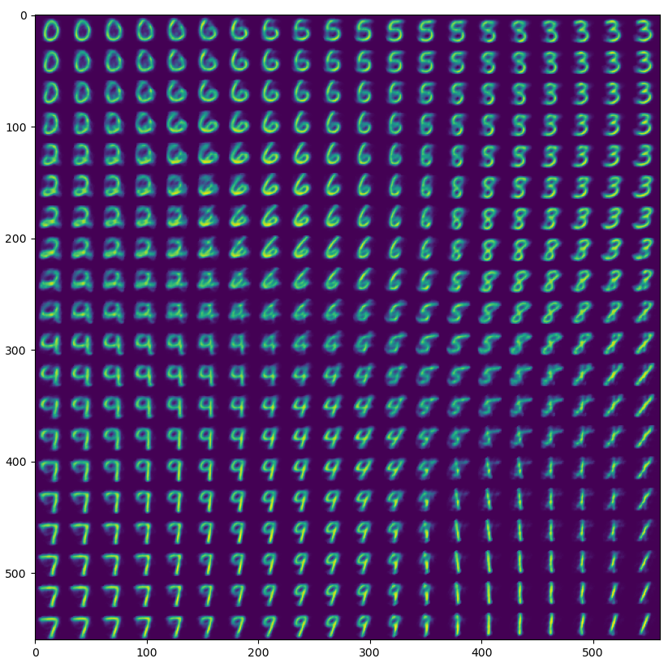

# Dehydrated VAE
Just add water.

## What is it?
A Keras-powered variational autoencoder builder

## Usage
Create an encoder (without the latent layers), and a decoder:
```python
latent_size = 2

encoder = Sequential([
  Dense(256, input_shape=[28 * 28], activation="tanh"),
  Dense(128, activation="tanh")
])

decoder = Sequential([
  Dense(256, input_shape=[latent_size]),
  Dense(128, activation="tanh"),
  Dense(28 * 28, activation="sigmoid")
])
```

Then create the VAE:
```python
from dehydrated_vae import build_vae

vae, encoder, decoder, loss = \
  build_vae(encoder, decoder, latent_size,
    kl_scale=1/np.prod(x_train.shape[1:]))
```

Then compile the VAE with the returned loss function, and fit:
```python
vae.compile(optimizer="adam", loss=loss)

vae.fit(x_train, x_train, epochs=10)
```

*See `example.py` for a full example*



